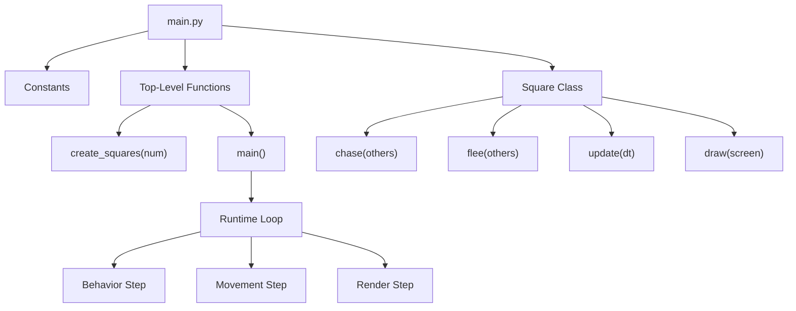
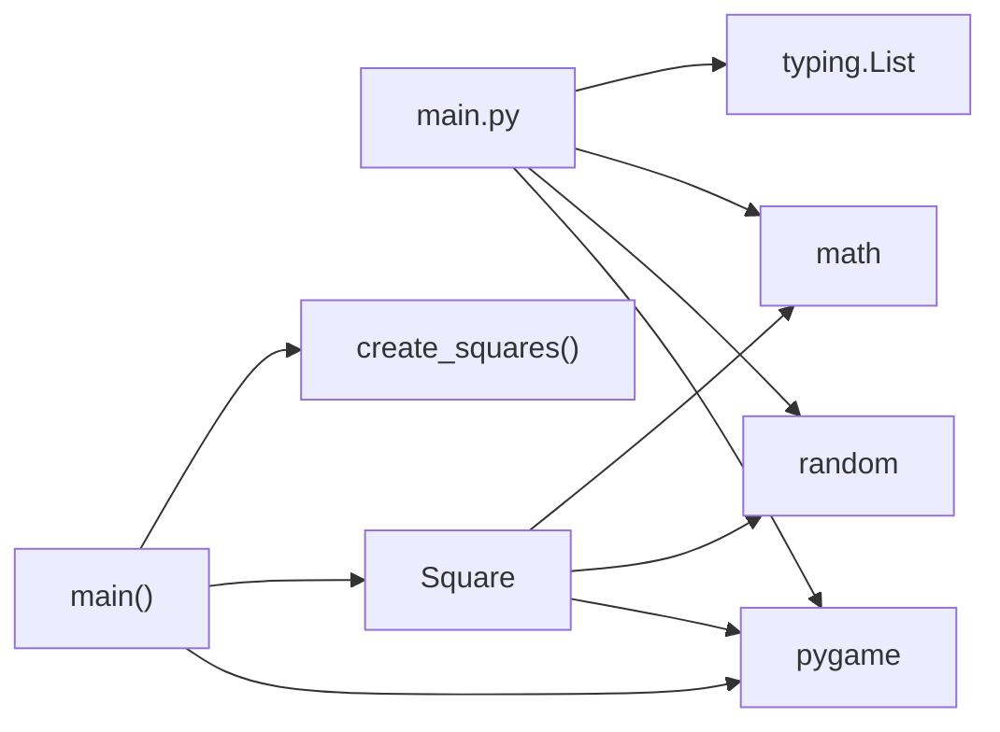
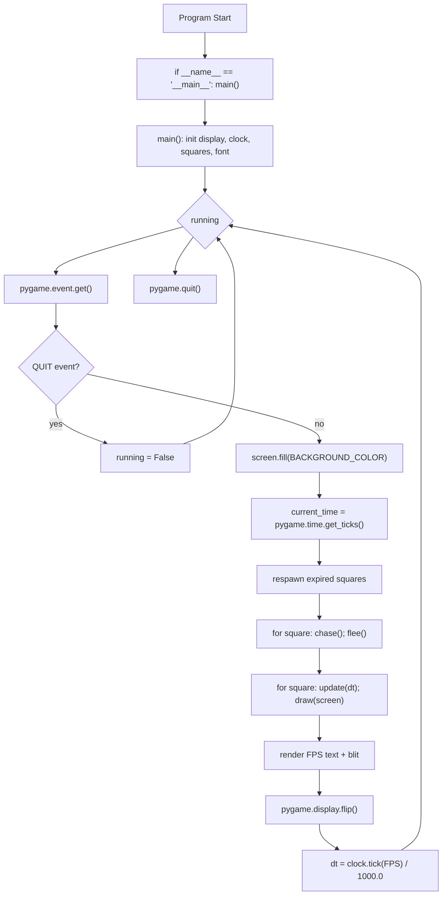
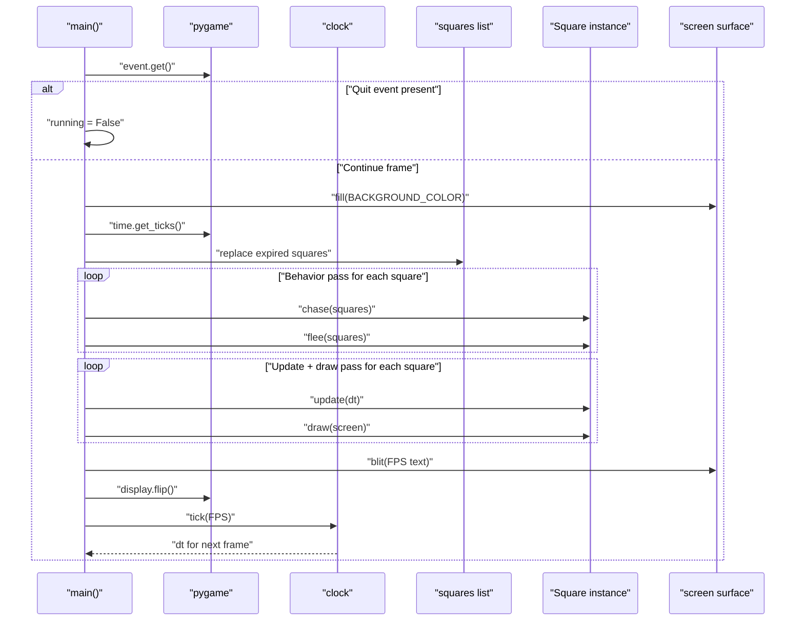

# Architecture Documentation

Source of truth: [main.py](../main.py)

## 1) High-Level Architecture Overview

This project is a single-file pygame simulation.

- `main()` owns initialization, the game loop, frame timing, lifecycle replacement, and shutdown.
- `Square` encapsulates entity state and behavior (`chase`, `flee`, `update`, `draw`).
- Global constants configure rendering, movement, behavior radii, jitter, and population.

## 2) Component / Module Breakdown

- `main.py`: Entire application module.
- Constants block: Window size, square counts/sizes, speed limits, behavior thresholds, frame rate, colors.
- Class `Square`: Entity model + per-entity AI/motion/render behavior.
- `create_squares(num)`: Factory for initial entity list.
- `main()`: Orchestrator for pygame setup, per-frame updates, and teardown.

### Dependency Graph

## 3) Class and Function Responsibilities

### Class: `Square`

- `__init__(x, y, size)`: Initializes position, size, speed-from-size mapping, velocity vector, random color, and lifetime window.
- `chase(others)`: Steers toward smaller nearby squares within `CHASE_RADIUS`.
- `flee(others)`: Steers away from larger nearby squares within `FLEE_RADIUS`.
- `update(dt)`: Applies random heading jitter, integrates position by delta time, wraps across screen bounds.
- `draw(screen)`: Renders rectangle onto pygame surface.

### Functions

- `create_squares(num)`: Builds a list of randomly placed `Square` instances.
- `main()`: Validates config, initializes pygame resources, runs event/update/render loop, computes `dt`, quits pygame.

## 4) Call Graph of Main Runtime Loop

## 5) Sequence Diagram: One Frame Update/Render Cycle

## 6) Data Model / State

### `Square` instance state

- Spatial: `x`, `y`, `size`
- Motion: `vx`, `vy`, `max_speed`
- Visual: `color`
- Lifecycle: `birth_time`, `lifespan`

### Runtime state in `main()`

- `screen`: pygame display surface
- `clock`: frame timing source
- `squares`: mutable list of active entities
- `font`: FPS text renderer
- `dt`: delta time in seconds (used by `update`)
- `running`: loop control flag

## 7) Configuration Constants

Defined in [main.py](../main.py):

- Display: `SCREEN_WIDTH=800`, `SCREEN_HEIGHT=600`, `BACKGROUND_COLOR=(255, 255, 255)`, `FPS=60`
- Population/size: `NUM_SQUARES=20`, `MIN_SIZE=10`, `MAX_SIZE=50`
- Speed: `GLOBAL_MAX_SPEED=240`, `V_MAX=GLOBAL_MAX_SPEED`, `V_MIN=60`
- Random steering: `JITTER_PROBABILITY=0.04`, `MAX_JITTER_ANGLE=0.12`
- Behavior radii: `FLEE_RADIUS=60`, `CHASE_RADIUS=90`

Notes:
- Size controls max speed linearly between `V_MAX` and `V_MIN`.
- `main()` guards against `MAX_SIZE <= MIN_SIZE` to avoid division by zero in speed interpolation.

## 8) Extension Points

- Behavior composition order: `chase()` then `flee()` is explicit; adding flocking/alignment or obstacle avoidance can plug into this pass.
- Entity lifecycle: respawn policy (currently age-based replacement) can be replaced with score/collision/event-driven logic.
- Rendering: replace rectangle drawing with sprites, rotation, or particle effects in `draw()`.
- Input/control: event loop can add keyboard/mouse interactions (pause, spawn, parameter tuning).
- Configuration: move constants to a settings structure or external config file for runtime tuning.
- Entity type system: introduce subclasses or strategy objects for multiple agent behaviors.
